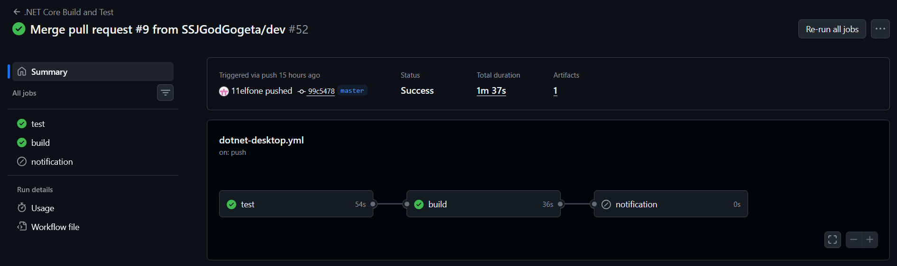

# Triggers

Current configuration:

```yaml
on:
  pull_request:
    branches: [ "master" ]
  push:
    branches: [ "master", "dev" ]
```

## Why `push`?

The `push` trigger ensures that every commit pushed directly to important branches is validated.

Current behavior:

| Branch   | Purpose                               |
| -------- | ------------------------------------- |
| `master` | Validate production-ready code        |
| `dev`    | Validate integration/development work |

Benefits:

* Detects build failures immediately after code is pushed.
* Prevents broken code from accumulating in shared branches.
* Produces build artifacts for successful commits.

---

## Why `pull_request`?

The `pull_request` trigger validates changes before they are merged into `master`.

Benefits:

* Prevents regressions from entering the main branch.
* Executes formatting checks and tests on proposed changes.
* Generates Discord notifications specifically for code reviews.

This follows a standard CI pattern:

```text
Developer Branch
       ↓
 Pull Request
       ↓
   CI Validation
       ↓
     Merge
```

---

## Should `workflow_dispatch` be added?

Recommendation: **Maybe**

Benefits:

* Allows maintainers to rerun the pipeline manually.
* Useful after infrastructure issues.
* Useful when testing CI changes.
* Useful when validating release candidates without creating a new commit.

Typical use cases:

* Rebuilding artifacts.
* Verifying fixes to flaky tests.
* Running CI after secret updates.
* Validating release branches.

---

# Runner

Current configuration:

```yaml
runs-on: ubuntu-latest
```

## Why `ubuntu-latest`?

This is generally the preferred runner for .NET server-side applications because it provides:

* Fast startup times.
* Lowest GitHub-hosted runner cost.
* Excellent support for .NET SDK tooling.
* Consistent environment across executions.

Benefits:

* Faster package restore.
* Faster build times.
* Lower maintenance burden.

Also because it is explicitly required in the objective.

---

## When would another runner be required?

### Windows

```yaml
runs-on: windows-latest
```

Use when:

* Building WPF applications.
* Building WinForms applications.
* Using Windows-specific APIs.
* Creating MSIX installers.

### macOS

```yaml
runs-on: macos-latest
```

Use when:

* Building Apple platform applications.
* Testing macOS-specific functionality.

For the current workflow, `ubuntu-latest` is appropriate because only standard .NET CLI commands are executed.

---

# Environment Configuration

Global environment variables:

```yaml
env:
  Solution_Name: ESBot
  Build_Directory: Build
  DOTNET_VERSION: 9.0.x
  CONFIGURATION: Release
```

## .NET Version

Configured SDK:

```yaml
DOTNET_VERSION: 9.0.x
```

Installed via:

```yaml
uses: actions/setup-dotnet@v4
```

This ensures all jobs run against the same .NET SDK major version.

---

## Build Configuration

```yaml
CONFIGURATION: Release
```

The workflow intentionally builds Release binaries because:

* Release is the configuration deployed to production.
* Compiler optimizations are enabled.
* CI validates the exact build profile intended for deployment.

---

## Caching

Current state:

**No cache is configured.**

The workflow restores packages every run:

```yaml
dotnet restore
```

Recommended improvement:

```yaml
- uses: actions/setup-dotnet@v4
  with:
    dotnet-version: 9.0.x
    cache: true
```

Benefits:

* Faster NuGet restores.
* Reduced build time.
* Lower network usage.

---

# Jobs and Steps

The workflow contains three jobs:

```text
test
 └─► build
       └─► notification
```

---

## Test Job

Purpose:

* Validate formatting.
* Execute automated tests.
* Extract test statistics.

### Checkout

```yaml
actions/checkout@v4
```

Fetches repository contents.

`fetch-depth: 0` retrieves full Git history, which is useful if versioning or Git-based tooling is later introduced.


### Install .NET

```yaml
actions/setup-dotnet@v4
```

Installs the configured SDK version.


### Verify Formatting

```yaml
dotnet format style --verify-no-changes
```

Fails the pipeline if formatting changes would be required.

Purpose:

* Enforces consistent code style.
* Prevents formatting-only commits later.


### Execute Unit Tests

```yaml
dotnet test
```

Runs all discovered test projects.

Outputs:

* Test execution results.
* TRX test report.


### Parse Test Results

Reads:

```text
./TestResults/test_results.trx
```

Extracts:

* Passed tests
* Failed tests

These values become job outputs:

```yaml
outputs:
  passed
  failed
```

which are later consumed by the notification job.

---

## Build Job

Depends on:

```yaml
needs: test
```

Meaning:

* Build only runs if tests complete successfully.

### Restore Dependencies

```yaml
dotnet restore
```

Downloads NuGet packages.


### Build

```yaml
dotnet build --configuration Release --no-restore
```

Compiles the application.


### Publish

```yaml
dotnet publish --output ./publish --no-build
```

Produces deployable artifacts.


### Upload Artifacts

```yaml
actions/upload-artifact@v4
```

Publishes:

```text
./publish
```

as:

```text
api-build
```

Artifacts can later be downloaded from the GitHub Actions run.

---

## Notification Job

Depends on:

```yaml
needs: [test, build]
```

Runs only for:

```yaml
if: github.event_name == 'pull_request'
```

Purpose:

* Provide build feedback to reviewers.

### Status Determination

Calculates:

* Success
* Failure
* Cancelled
* Skipped

and assigns matching Discord colors.


### Discord Notification

Uses:

```yaml
tsickert/discord-webhook@v5.0.0
```

Sends:

* Build status
* Branch
* Commit
* Author
* Test statistics
* Workflow URL

to the configured Discord webhook.

---

# What Runs in CI Today?

Current CI coverage:

| Validation                | Included |
| ------------------------- | -------- |
| Code formatting           | Yes      |
| Unit tests                | Yes      |
| Dependency restore        | Yes      |
| Release build             | Yes      |
| Publish output            | Yes      |
| Artifact upload           | Yes      |
| Pull request notification | Yes      |

---

# What Is Intentionally Out of CI?

The workflow does not currently execute:

## Live LLM Calls

Examples:

* OpenAI API requests
* Anthropic API requests
* External AI providers

Reasons:

* Cost
* Rate limits
* Deterministic testing concerns
* Secret management complexity

Recommended approach:

* Mock LLM responses in tests.
* Execute live evaluations separately.

---

## Production Databases

Examples:

* Production PostgreSQL
* Production SQL Server
* Production MongoDB

Reasons:

* Safety
* Data integrity
* Reproducibility

Recommended approach:

* Use test containers.
* Use local databases.
* Use in-memory providers.

---

## End-to-End Production Integrations

Examples:

* Discord production servers
* Payment gateways
* External SaaS services

Reasons:

* Cost
* Reliability
* Side effects

Recommended approach:

* Mock external services during CI.

---

# Parity with Local Development

CI should mirror local Phase A validation as closely as possible.

## Local Commands

Developers should be able to run:

```bash
dotnet format style --verify-no-changes
```

```bash
dotnet test --configuration Release
```

```bash
dotnet restore
```

```bash
dotnet build --configuration Release
```

```bash
dotnet publish
```

before pushing changes.

---

## Mapping Local Commands to CI

| Local Command                             | CI Step              |
| ----------------------------------------- | -------------------- |
| `dotnet format style --verify-no-changes` | Verify format style  |
| `dotnet test`                             | Execute unit tests   |
| `dotnet restore`                          | Restore dependencies |
| `dotnet build`                            | Build .NET API       |
| `dotnet publish`                          | Publish .NET API     |

---

# Troubleshooting CI vs Local Differences

## CI Fails, Local Passes

Common causes:

### Missing Restore

Reproduce CI exactly:

```bash
dotnet restore
dotnet build --configuration Release
dotnet test --configuration Release
```

---

## CI Passes, Local Fails

Common causes:

### Hidden Uncommitted Files

Local builds may succeed or fail because of files not committed to Git.

Verify with:

```bash
git status
```


### Outdated SDK

Update local .NET SDK.


### Corrupted NuGet Cache

Clear cache:

```bash
dotnet nuget locals all --clear
```


### Local Environment Differences

Examples:

* Custom environment variables
* Local secrets
* Local configuration files

CI runs in a clean environment every execution.


### Different SDK Version

Check:

```bash
dotnet --version
```

Compare with:

```yaml
DOTNET_VERSION: 9.0.x
```

Use a matching SDK locally.


### OS Differences

CI runs on Linux.

Potential issues:

* Case-sensitive file paths
* Path separator assumptions
* Windows-only APIs


# Exercise 9.2 Enhancements

## NuGet Package Caching

As part of Exercise 9.2, the CI pipeline was enhanced by enabling NuGet package caching through the `.NET Setup` action.
Any packages already present on the action runner won't be cached unnecessarily.

## Added Action or Tool

The enhancement uses the built-in caching functionality provided by the GitHub Action `actions/setup-dotnet@v4`.

When caching is enabled, GitHub Actions automatically stores downloaded NuGet packages between workflow runs. On subsequent executions, the cache is restored before the build starts. In addition, packages that are already available on the GitHub-hosted runner can be reused immediately, reducing the amount of network traffic and package downloads required during dependency restoration.

## Why This Fits ESBot

The ESBot project depends on a number of external NuGet packages that must be restored before the solution can be built and tested. Package restoration is performed on every CI execution and therefore occurs frequently.

The caching enhancement provides several concrete benefits:

### Speed

The primary benefit is faster workflow execution. Packages that have already been downloaded do not need to be fetched again from NuGet.org, which reduces restore times and shortens overall CI duration.

### Reliability

Reducing external package downloads lowers dependency on network availability and package repository response times. Builds become more predictable and less affected by temporary network slowdowns.

### Compatibility

The cache mechanism is fully integrated into the official .NET GitHub Action and requires no changes to the ESBot build process. Developers continue using standard `dotnet restore`, `dotnet build`, and `dotnet test` commands.

### Security

The enhancement does not bypass package verification or dependency resolution. Package versions remain controlled by the project files and lock files, ensuring that the same validated dependencies are restored. Only previously downloaded packages are reused.

## Added Value vs. Cost

| Aspect              | Assessment |
|-|-|
| Runtime Impact      | Positive. Dependency restoration is typically faster, especially on repeated workflow executions. |
| Maintenance Cost    | Very low. The feature is maintained by GitHub through `actions/setup-dotnet` and requires no custom scripts. |
| Infrastructure Cost | Reduced Infrastructure Cost. |
| Complexity          | Minimal. Only a small configuration change was required. |

Overall, the benefit-to-cost ratio is highly favorable because build performance improves while operational complexity remains almost unchanged.

## Local and CI Parity

The dependency restoration process remains identical between local development and CI.

Local developers continue to use:

```bash
dotnet restore
dotnet build
dotnet test
```

The CI pipeline executes the same commands. The only difference is that GitHub Actions now restores previously cached NuGet packages before running `dotnet restore`.

Because the actual restore operation is unchanged, local and CI environments remain aligned. Any package-related issue that occurs locally can still be reproduced in CI, and vice versa. The cache acts only as a performance optimization and does not modify the build, test, or dependency resolution behavior.


# Proof of successful CI pipeline run




*Info: ChatGPT used to refine phrasing*
