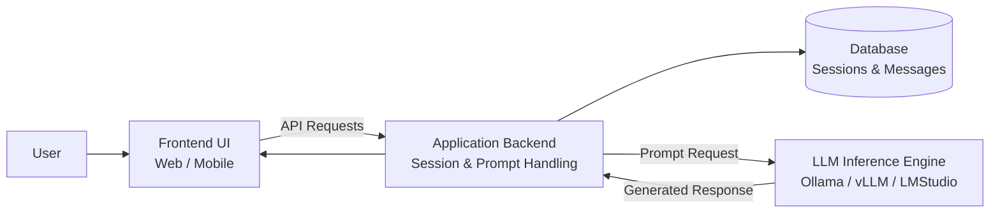

# ESBot – Case Study Description for Software Testing Course

## Introduction to the ESBot Application

The ESBot application is designed as an AI-powered learning assistant that supports students throughout their individual learning process. It provides a structured conversational interface through which users can explore course-related topics, receive explanations, and actively practice their knowledge. Unlike generic chat systems, ESBot focuses on educational support by guiding users through learning content, generating exercises, and offering feedback on their responses.

A central aspect of ESBot is its ability to facilitate **interactive learning sessions**. Students can ask questions related to course material and receive contextualized explanations tailored to their needs. In addition, ESBot can generate practice questions and small quizzes, enabling users to test their understanding in a lightweight and iterative manner. This interaction model encourages active engagement rather than passive consumption of information.

Beyond simple question-answering, ESBot introduces **guided learning functionality**. The system supports users in deepening their understanding by offering follow-up explanations, examples, and clarification prompts. While the responses are generated using AI-based inference, the system is expected to structure interactions in a way that remains comprehensible and pedagogically useful.

Another important element is the handling of **learning sessions and progress context**. User interactions are stored in a persistent manner, allowing the system to maintain conversational continuity and provide a coherent learning experience over time. This enables students to revisit previous questions, track their progress, and continue learning without losing context.

From a technical perspective, ESBot is designed as a **three-tier architecture**, consisting of a frontend (user interface), a backend (application logic and API), and a data layer (persistent storage). AI inference is performed through external or locally hosted models (e.g., via Ollama, vLLM, or LM Studio), which are integrated into the backend as a dedicated service. This modular design ensures separation of concerns and supports extensibility as well as testability.

ESBot is intended as a **web-based application**, allowing access from various devices without requiring installation. The system is deliberately scoped to remain focused and lightweight, ensuring that students can use it without extensive onboarding while still benefiting from meaningful AI-assisted learning interactions.

Importantly, ESBot acknowledges the **non-deterministic nature of AI-generated responses**. Therefore, the system is designed to handle uncertainty by structuring outputs, validating responses where possible, and presenting results in a controlled and user-friendly manner.

Overall, ESBot serves as a practical and modern example of an AI-integrated system, combining conversational interfaces, modular architecture, and educational use cases. It is particularly suited for teaching software engineering and testing concepts, as it introduces realistic challenges such as external dependencies, probabilistic outputs, and system integration.

---

## High-Level Expectations

### 1. Learning-Centered Interaction
The system must support students in understanding and practicing course content through guided conversational interaction.

### 2. Structured AI Integration
AI-generated responses should be embedded in a controlled interaction flow, ensuring clarity and usability.

### 3. Persistence of Learning Context
User sessions and interactions should be stored to allow continuity and progress tracking.

### 4. Modular and Layered Architecture
The system must follow a clear separation between frontend, backend, data storage, and AI inference components.

### 5. Testability and Observability
The system must be designed in a way that enables comprehensive testing across all layers, including mocking of AI components.

---

## Minimal System Architecture

ESBot follows a minimal three-tier architecture:
- User Interface (UI) - Tier1
- Application Backend - Tier2
- Database - Tier3
- LLM Inference Engine  (optional)

The architecture is designed to be modular and extensible, allowing for the easy addition of new features and the replacement of existing components.

The architecture is designed to be testable, allowing for the testing of the system at multiple levels, including unit testing, integration testing, API testing, and system testing.

---

## Functional Requirements for the ESBot Application

### 1. Conversational Learning Interface
The system shall allow users to interact with ESBot via a chat-based interface to ask questions and receive explanations related to learning content.

### 2. Explanation and Example Generation
The system shall generate structured explanations and, where appropriate, provide examples to clarify concepts.

### 3. Quiz and Practice Generation
The system shall allow users to request practice questions or quizzes related to a given topic.

### 4. Answer Evaluation
The system shall provide basic feedback on user-submitted answers to generated questions, indicating correctness or areas for improvement.

### 5. Session Management
The system shall maintain user sessions and store interaction history to enable continuity across multiple interactions.

### 6. Backend API Access
The system shall expose its functionality via a well-defined RESTful API, enabling communication between frontend and backend.

---

## Non-Functional Requirements for the ESBot Application

### 1. Usability
The system shall provide an intuitive and accessible user interface that allows first-time users to interact with ESBot without prior training.

### 2. Performance
The system should respond to user queries within 2–5 seconds under normal load conditions (up to 50 concurrent users).

### 3. Scalability
The system should support scaling of backend and AI inference components independently to handle increased usage.

### 4. Reliability
The system shall handle failures of external AI services gracefully, ensuring that users receive meaningful fallback responses instead of system errors.

### 5. Maintainability
The system shall follow a modular architecture that separates concerns (UI, backend logic, data storage, AI integration) to allow easy extension and modification.

### 6. Testability
The system shall be designed to support unit, integration, and system testing, including the ability to mock AI inference components.

### 7. Security
The system shall protect user data and ensure that stored session information is handled securely. Basic input validation must be implemented to mitigate malicious inputs.

### 8. Observability
The system should provide logging and monitoring capabilities to trace interactions, system behavior, and potential failures.

---

## Summary

ESBot combines AI-based conversational capabilities with a structured learning focus, making it a realistic and modern system for software engineering education. Its architecture introduces clear separation of concerns, while its functionality enables meaningful user interaction. At the same time, the integration of AI components introduces non-deterministic behavior, making ESBot particularly suitable for exploring advanced testing strategies across multiple system layers.
