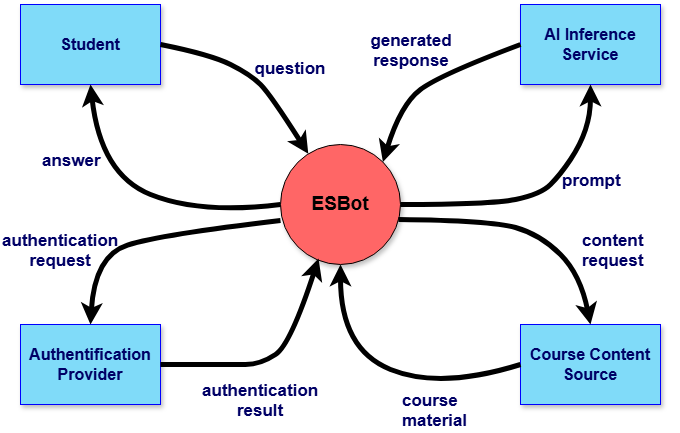

# System Context

## Overview

The context diagram shows how ESBot interacts with external actors and neighboring systems.

Our goal was to clearly define:

- what belongs to ESBot (system scope)
- what is outside (context)
- how data flows between them

---

## System Boundary

We model ESBot as a **black-box system**.

Inside the system:

- all internal logic (frontend, backend, database)
- processing of user input
- orchestration of AI and content retrieval

---

## External Actors and Systems

We identified the following external actors and neighboring systems:

### 1. Student

- Primary user of the system
- Sends questions and receives answers

### 2. AI Inference Service

- External system used to generate responses
- ESBot sends prompts and receives generated answers

### 3. Authentication Provider

- Handles user authentication (e.g., login)
- Returns authentication results to ESBot

### 4. Course Content Source

- Provides learning materials and course-related content
- Supports ESBot in generating contextualized responses

---

## Data Flows

- Student → ESBot: `question`
- ESBot → Student: `answer`

- ESBot → AI Inference Service: `prompt`
- AI Inference Service → ESBot: `generated response`

- ESBot → Authentication Provider: `authentication request`
- Authentication Provider → ESBot: `authentication result`

- ESBot → Course Content Source: `content request`
- Course Content Source → ESBot: `course material`

---

## Design Decisions

- We treat ESBot as a **single system**, not as separate layers
- External systems are only included if they **directly interact with ESBot**
- The diagram focuses on the **system boundary** and avoids internal architectural details

---

## Context Diagram

