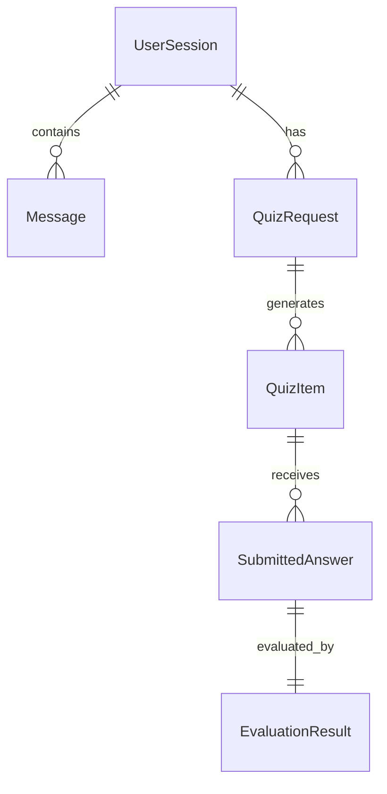

# ESBot Data Model (Exercise 4.2)

## Entities

| Entity | Description |
|--------|-------------|
| `UserSession` | A student's learning session with metadata |
| `Message` | A single chat turn (user or assistant) |
| `QuizRequest` | Request to generate practice questions on a topic |
| `QuizItem` | A generated multiple-choice question |
| `SubmittedAnswer` | User's answer to a quiz question |
| `EvaluationResult` | LLM-generated feedback on an answer |

## Relationships

| Relationship | Cardinality |
|--------------|-------------|
| UserSession → Message | 1:N |
| UserSession → QuizRequest | 1:N |
| QuizRequest → QuizItem | 1:N |
| QuizItem → SubmittedAnswer | 1:N |
| SubmittedAnswer → EvaluationResult | 1:1 |

## Persistence strategy

- **Database:** PostgreSQL 16 (local via docker-compose)
- **ORM:** SQLAlchemy 2.0 with Alembic migrations
- **Tests:** SQLite in-memory for fast, isolated repository and API tests

## Design decisions

1. **LLM is not a domain entity** — `LLMClient` is a service interface, mockable in tests (Exercise 4/8).
2. **Cascade deletes** — deleting a `UserSession` removes messages, quizzes, and evaluations.
3. **No User table** — `user_id` is a simple string for session listing; multi-user auth is out of scope.
4. **UUID primary keys** — globally unique IDs suitable for REST APIs.

## Validation

- Non-blank `Message.content`, `QuizRequest.topic`, `SubmittedAnswer.answer`
- Max lengths: message 4000 chars, topic 256 chars, answer 500 chars
- Enforced in Pydantic domain models and API request schemas
