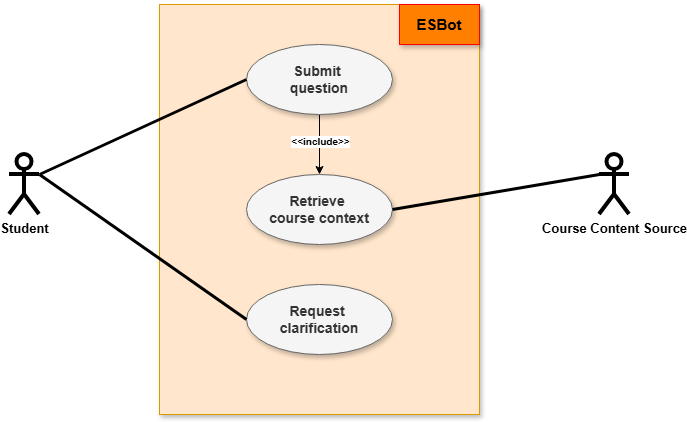

# Use Case Description

**Use Case ID**: UC-001  
**Title**: Request contextualized response  
**Primary Actor**: Student

**1. Stakeholders and Interests**:

- **Student**: wants to ask a course-related question and receive a contextualized explanation
- **System Owner**: wants to provide accurate and relevant learning support
- **Course Content Source**: wants to provide up-to-date learning material to support accurate responses

**2. Preconditions**:

- The student has access to ESBot
- The system is available and operational

**3. Trigger**:

- The student enters a question into the chat interface and submits it

**4. Main Success Scenario**:

1. Student enters a course-related question
2. Student submits the question
3. System receives the question
4. System retrieves relevant course context
5. System generates a contextualized response
6. System displays the response to the student

**5. Postconditions**:

- The student receives a contextualized answer
- The interaction is stored and available for further conversation

**6. Extensions (Alternate Flows)**:

- **a.** Empty or Invalid Input:
  - System displays an error message
  - Student corrects the input and resubmits

- **b.** No Relevant Context Found:
  - System proceeds without additional context
  - System generates a general response

- **c.** Response Generation Fails:
  - System displays an error message
  - Student may retry the request

**7. Special Requirements**:

- The system should respond within a reasonable time
- The response should be understandable and relevant to the course context

**8. Frequency of Use**:

- Very frequent (multiple times per learning session)

---

## Explanation

- The diagram focuses on the feature **"Request contextualized response"**

- **Primary actor**:
  - Student interacts with ESBot to submit questions and request clarifications

- **Main use case**:
  - "Submit question" represents the core interaction between the student and the system

- **Include relationship**:
  - "Submit question" includes "Retrieve course context"
  - ESBot uses external learning material to generate context-aware responses

- **Secondary actor**:
  - Course Content Source provides course-related learning material

- **Overall idea**:
  - User input, external content, and system logic work together to produce a contextualized response

---

## Use Case Diagram

