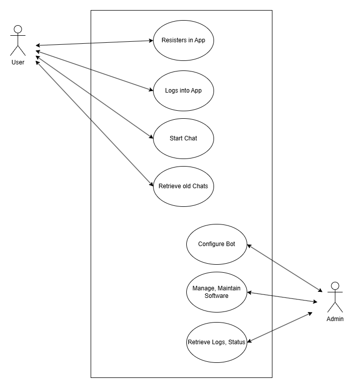

# Use Cases
## Table of Contents
[User Register in ESBot App (UC-001)](#use-case-uc-001)  
[Login into ESBot Account (UC-002)](#use-case-uc-002)  
[Chat with ESBot (UC-003)](#use-case-uc-003)  
[Retrieve Old Chats (UC-004)](#use-case-uc-004)  
[Configure ESBot (UC-005)](#use-case-uc-005)  
[Managing and Maintaining Software (UC-006)](#use-case-uc-006)  
[Retrieving Logs and Status (UC-007)](#use-case-uc-007)  

## Use Case Diagram

## Use Case UC-001
Use Case ID: UC-001    
Title: User Register in ESBot App  
Primary Actor: User  
Stakeholders and Interests:
  - User: Wants to create an Account to save progress and access chat history
  - System Owner: Wants to ensure only authorized user access the platform

Preconditions:
  - User does not have an existing account with provided credentials

Trigger:
  - User clicks on the "Register" button

Main Success Scenario:
  1. User enters name, email, and password
  2. System validates input (email format, password strength)
  3. System creates a new user profile in the database
  4. System confirms successful registration to the User

Postconditions:
  - A new account is created and stored persistently
    
Extensions (Alternate Flows):
  - 2a. Invalid Email Format:
    - 2a1. System notifies the User that the email format is incorrect
    - 2a2. User corrects the email and resubmits
      
 3a. Email Already Exists:
    - 3a1. System informs the User that an account with this email already exists
    - 3a2. System suggests the User logs in or resets their password

Special Requirements:
  - Account data must be stored securely
  - User email must be unique

Frequency of Use:
  - High frequency at first (on launch a lot of people will register their account)
  - Low frequency after

## Use Case UC-002
Use Case ID: UC-002  
Title: Login into ESBot Account  
Primary Actor: User  
Stakeholders and Interests:
  - User: Wants secure access to their personal chat data and features

Preconditions:
  - User enters credentials on the login page
Trigger:
  - User enters credentials on the login page

Main Success Scenario:
  1. User enters email and password
  2. System  verifies credentials against the database
  3. System generates secure session token
  4. System redirects the User to the main chat interface

Postconditions:
  - User is authenticated and authorized to use the application
    
Extensions (Alternate Flows):
  - 2a. Wrong Password / Invalid Credentials:
    - 2a1. System displays an "Invalid email or password" error message
    - 2a2. System logs the failed attempt for security monitoring
    - 2a3. User attempts to log in again
    - 
 2b. Account Locked:
    - 2b1. After X failed attempts, the system temporarily locks the account
    - 2b2. System instructs the User to wait or reset their password
      
Frequency of Use:
  - High frequency (daily use by multiple students)

## Use Case UC-003
Use Case ID: UC-003  
Title: Chat with ESBot  
Primary Actor: User  
Stakeholders and Interests:
  - User: Wants to ask questions and receive accurate, contextualized answers to learn and practice course content
  - System Owner: Wants the system to process requests efficiently, provide correct answers, and maintain session data securely
  - Admin: Wants the system to log interactions and maintain AI integration properly

Preconditions:
  - User has registered and is logged in
  - Chat interface is available
  - External AI (LLM) is operational

Trigger:
  - User types a question or prompt into the chat interface

Main Success Scenario:
  1. User opens the chat interface
  2. User types a question or prompt related to course material
  3. User submits the input
  4. ESBot validates the input
  5. ESBot sends the prompt to the External AI (LLM)
  6. LLM generates a contextualized answer
  7. ESBot receives the generated answer
  8. ESBot displays the answer to the User
  9. ESBot stores the conversation in the database
 10. User continues the conversation or ends the session

Postconditions:
  - User receives a contextualized answer
  - Conversation is stored persistently for future retrieval

Extensions (Alternate Flows):
  - 3a. User Aborts Generation:
    - 3a1. User clicks a "Stop" or "Cancel" button while the LLM is streaming a response
    - 3a2. ESBot halts the request to the External AI
    - 3a3. System displays a "Generation cancelled" message and stops usage of tokens
      
  - 5a. LLM Request Fails (Timeout/API Down):
    - 5a1. ESBot notifies the User of a temporary connection issue
    - 5a2. System offers a "Retry" button

Special Requirements:
  - Responses should be generated within 2 seconds
  - User data must be stored securely
  - Chat interface must be intuitive and support multiple concurrent users

Frequency of Use:
  - High frequency (daily use by multiple students)

## Use Case UC-004
Use Case ID: UC-004  
Title: Retrieve Old Chats  
Primary Actor: User  
Stakeholders and Interests:
  - User: Wants to review past learning materials and previous AI answers
  - System Owner: Wants to provide a seamless, persistent user experience

Preconditions:
  - User is logged in
  - Previous chat session exists in the database

Trigger:
  - User navigates to the "History" section
    
Main Success Scenario:
  1. User opens the chat history view
  2. System fetches all stored chat sessions associated with the User ID
  3. System displays a list of past chats sorted by date
  4. User selects a specific chat session
  5. System retrieves and displays the full conversation history.

Postconditions:
  - User successfully views the content of a previous conversation

Extensions (Alternate Flows):
  - 2a. No Chat History Found:
    - 2a1. System displays a message: "No previous chats found. Start your first conversation!"
    - 2a2. User is redirected to the main chat interface
      
  - 4a. Database Timeout:
    - 4a1. System fails to retrieve chat details due to high load
    - 4a2. System displays a "Could not load chat, please try again" message

Frequency of Use:
  - Low frequency

## Use Case UC-005
Use Case ID: UC-005  
Title: Configure ESBot  
Primary Actor: Admin  
Stakeholders and Interests:
  - Admin: Wants the AI to stay aligned with course goals
  - System Owner: Wants to adjust bot behavior, system prompts or model parameters

Preconditions:
  - Admin is logged in with administrative privileges
  - Configuration interface is accessible

Trigger:
  - Admin needs to update the bot’s underlying logic or personality

Main Success Scenario:
  1. Admin opens the Bot Configuration Panel
  2. Admin modifies parameters (e.g., System Prompt, LLM Model version)
  3. Admin saves the new configuration
  4. System validates the settings and applies them to the EsBot engine

Postconditions:
  - The bot's behavior is updated for all future interactions

Extensions (Alternate Flows):
  - 3a. Invalid Configuration Parameters:
    - 3a1. Admin enters a value outside the allowed range
    - 3a2. System highlights the invalid field and prevents saving
      
  - 3b. Unauthorized Access Attempt:
    - 3b1. A non-admin user attempts to access the URL.
    - 3b2. System redirects the user to the dashboard with a "403 Forbidden" error

Frequency of Use:
  - Low frequency

## Use Case UC-006
Use Case ID: UC-006  
Title: Managing and Maintaining Software  
Primary Actor: Admin  
Stakeholders and Interests:
  - Admin: Wants to ensure the platform remains stable, updated, and secure
  - System Owner: Wants to minimize downtime and technical debt

Preconditions:
  - Admin has access to backend management tools/servers

Trigger:
  - Scheduled maintenance or a required software update

Main Success Scenario:
  1. Admin takes EsBot offline / switches into maintenance mode
  2. Admin deploys software updates or database migrations
  3. Admin verifies the integrity of the system and API connections
  4. Admin brings the system back to full operational status

Postconditions:
  - The software is up-to-date and running the latest stable version

Frequency of Use:
  - Medium frequency

## Use Case UC-007
Use Case ID: UC-007  
Title: Retrieving Logs and Status  
Primary Actor: Admin  
Stakeholders and Interests:
  - Admin: Needs to monitor system health and troubleshoot errors
  - System Owner: Wants to ensure transparency and auditability of system usage

Preconditions:
  - Admin is logged in
  - Logging service is available

Trigger:
  - Admin needs to check system performance or investigate a bug report

Main Success Scenario:
  1. Admin accesses the Logs/Status Dashboard
  2. System displays real-time metrics (CPU usage, API latency, error rates)
  3. Admin filters logs by date, user ID, or error type
  4. System generates a view or report of the requested log data

Postconditions:
  - Admin has the necessary information to assess system health or resolve issues

Extensions (Alternate Flows):
  - 3a. Logs Not Available:
    - 3a1. System indicates that the logging service is currently unreachable
    - 3b2. Admin is prompted to check the connection to the logging provider
      
  - 3b. Massive Data Volume:
    - 3b1. Admin requests a log range that is too large for the browser to render
    - 3b2. System suggests narrowing the time range or downloading the logs as a CSV file
      
Frequency of Use:
  - Low to Medium frequency
